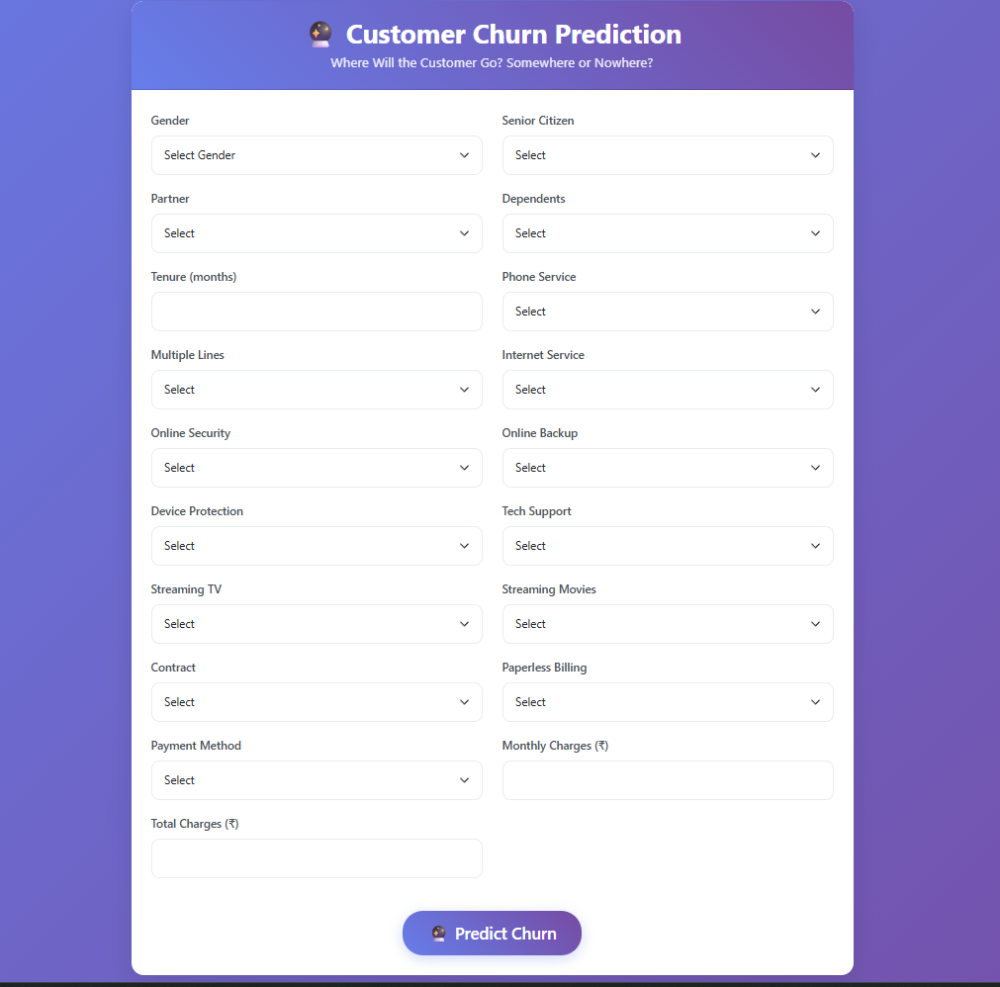
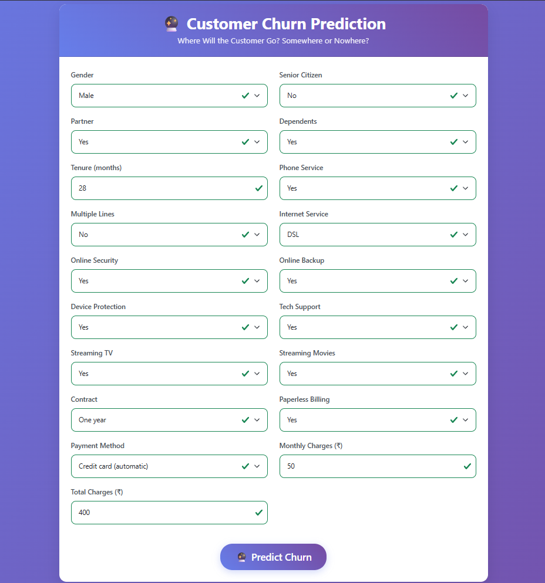
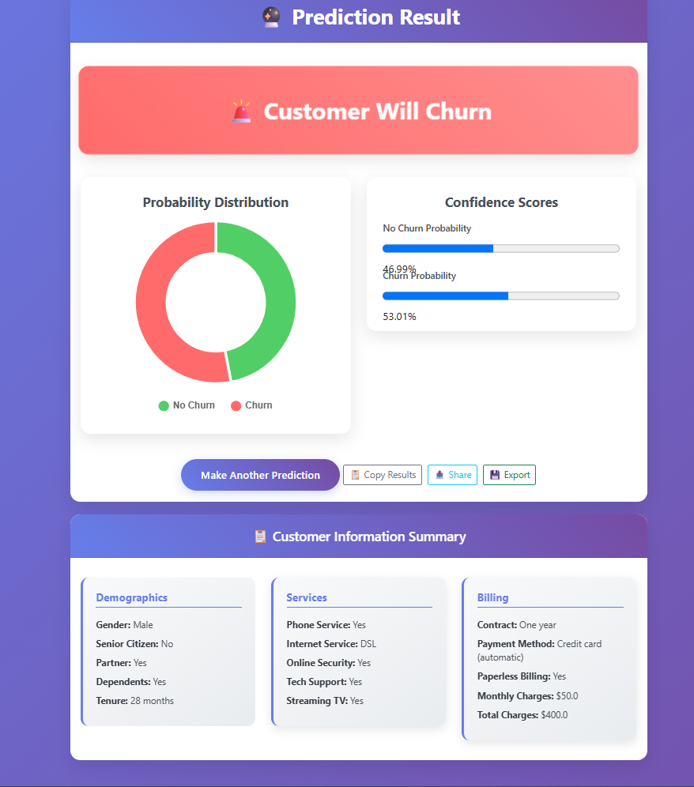
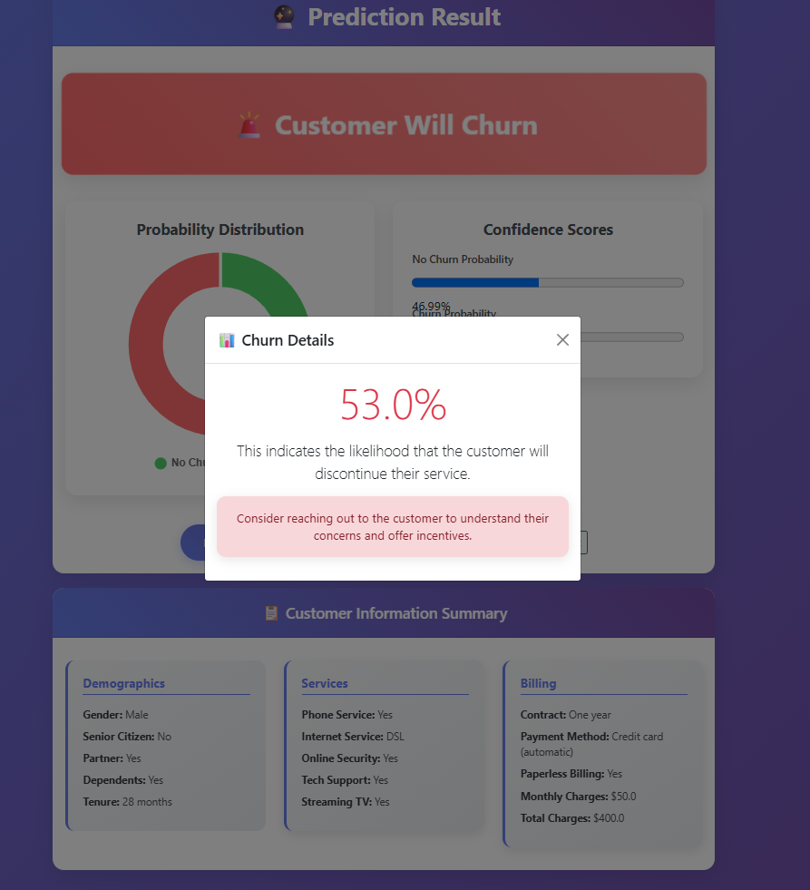
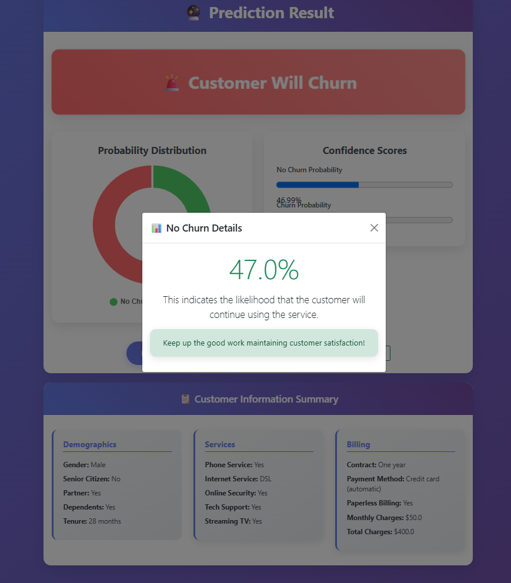

# Customer Churn Prediction Web App

Hey there! 👋 This is a web application I built to help businesses figure out which customers might leave them soon. It's pretty cool - you just enter some customer info and it gives you a prediction with nice charts and everything.

## What does it do?

So basically, this app takes information about a customer (like how long they've been with the company, what services they use, how much they pay, etc.) and predicts whether they're likely to cancel their subscription or not. It's like having a crystal ball for customer retention!

The whole thing runs in your browser with a clean, modern interface. You fill out a form, hit predict, and boom - you get charts, percentages, and all the insights you need.

## Screenshots

Here's what the app actually looks like in action:

### Main Form Interface

*The main prediction form where you enter customer information*

### Main Form Interface with Data

*The main prediction form with customer information*

### Results with Interactive Charts

*Prediction results showing probability scores and interactive charts*

### Responsive Charts 


*when any portion of the chart is clicked it gives details on churn*

## What's cool about it?

**The Interface**
- Looks really nice with smooth gradients and animations
- Works perfectly on your phone or computer
- Smart forms that help you fill things out correctly
- Interactive charts that you can actually click on
- Auto-calculates some fields to save you time

**The Smart Stuff**
- Uses machine learning to make predictions (not just random guesses!)
- Handles all the messy data processing behind the scenes
- Gives you confidence scores so you know how sure the prediction is
- Can handle both the web interface and API calls if you're into that

**Extra Goodies**
- Real-time validation so you don't waste time with bad data
- Export your results if you need them later
- Mobile-friendly because who isn't on their phone these days?
- Proper error handling so it doesn't just crash on you

## What I used to build this

I threw together a bunch of different technologies to make this work:

**Backend & Data Science:** Python, Flask, Pandas, NumPy, Scikit-learn, Pickle for saving the model

**Frontend & Design:** HTML5, CSS3, JavaScript, Bootstrap, Chart.js for those nice donut charts

**Styling & UX:** Custom CSS with gradients, responsive design, modern animations

**Machine Learning:** Data preprocessing, feature scaling, one-hot encoding, binary classification

## Getting it running

How to set up:

```bash
# Clone the Project
git clone https://github.com/flamekizer11/Customer-Churn-Prediction.git
cd Customer-Churn-Prediction

# Set up a virtual environment
python -m venv churn
churn\Scripts\activate

# Install dependencies
pip install -r requirements.txt

# Lets go!
python app.py
```

Then just open your browser and go to `http://127.0.0.1:5000`. That's it!

## How to use it

**The easy way:**
Just open it in your browser, fill out the form with customer info, and click "Predict Churn". You'll get a nice results page with charts and everything.

**The programmer way:**
If you want to integrate it into something else, there's an API endpoint at `/api/predict` that takes JSON data and spits back predictions.

Here's what a request looks like:
```bash
curl -X POST http://127.0.0.1:5000/api/predict \
  -H "Content-Type: application/json" \
  -d '{
    "gender": "Male",
    "senior_citizen": 0,
    "partner": "Yes",
    "tenure": 12,
    "monthly_charges": 85.0,
    ... and so on
  }'
```

## The files and folders

```
customer-churn-prediction/
├── app.py                 # The main Flask app
├── preprocessing.py       # All the data cleaning magic
├── requirements.txt       # What Python packages you need
├── data/
│   ├── batch_churn.csv   # Dataset for batch predictions
│   └── churn.csv         # Main training dataset
├── notebook/
│   └── model.pkl         # The trained ML model
├── templates/
│   ├── index.html        # The main form page
│   └── result.html       # Where results show up
├── static/
│   ├── css/
│   │   └── style.css     # Makes everything look pretty
│   └── js/
│       ├── main.js       # Form interactions
│       └── result.js     # Results page stuff
├── images/               # Screenshots of the website
```

## How the prediction works

The model looks at things like:
- Customer demographics (age, gender, if they have family)
- What services they use (phone, internet, streaming services)
- Their contract type and billing info
- How long they've been a customer
- How much they're paying

It processes all this information, runs it through the machine learning model, and gives you a probability score. The higher the score, the more likely they are to churn.


## Want to contribute?

Sure! If you want to add features or fix bugs, just:
1. Fork it
2. Make your changes
3. Test them out
4. Send me a pull request

Just try to keep the code readable and add some comments if you're doing something tricky.

## A few notes

- Make sure you have Python 3.7 or newer
- The model file needs to be in the right place (`notebook/model.pkl`)
- If something breaks, check the console for error messages
- The app assumes your data is reasonably clean (garbage in, garbage out!)

## Issues or questions?

If something's not working or you have ideas for improvements, just create an issue on GitHub. I try to check them regularly.
Or just let me know via [Email](pratiksinghyo02776@gmail.com)

---
*If you end up using this for something cool, I'd love to learn more.*
